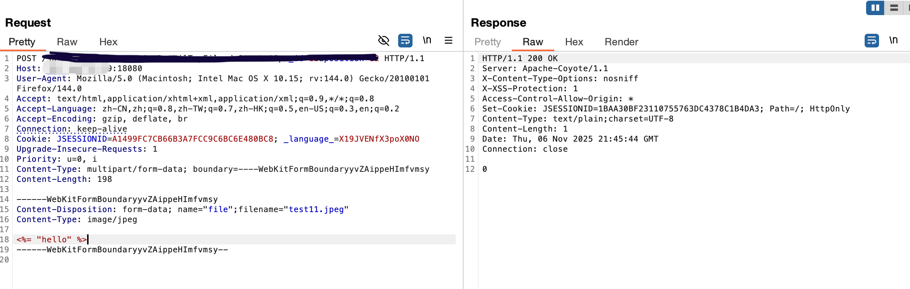
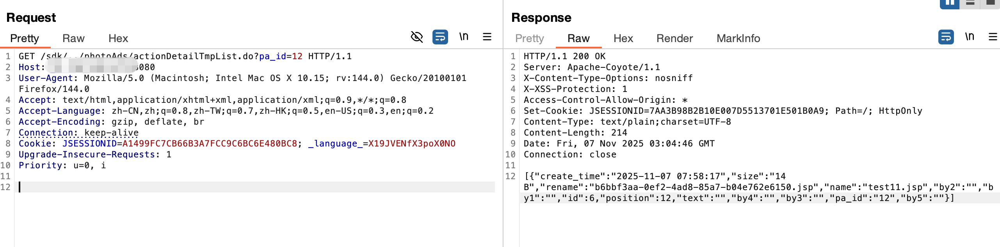
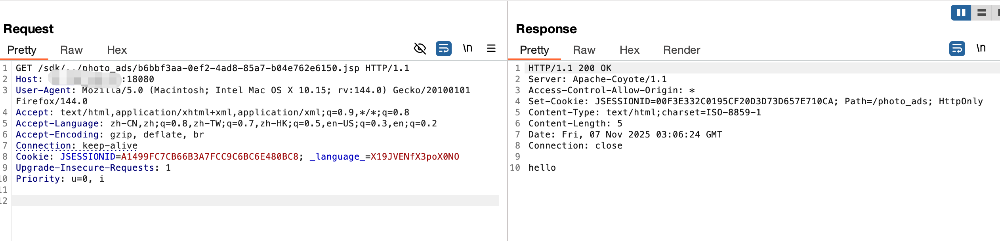
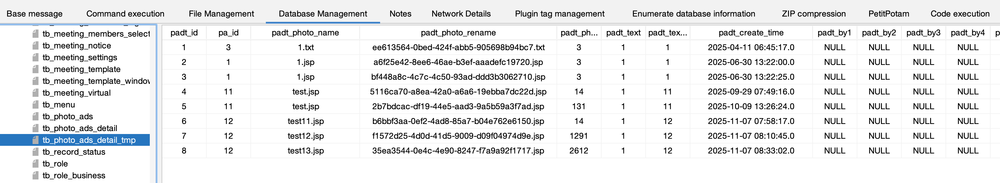

## 保伦电子 itC actionDetailTmpFile 任意文件上传漏洞分析

fofa:

app="HC-视频会议"&&country="CN" && region!="HK"


icon_hash="1698211506" && country="CN" && region!="HK"

# actionDetailTmpFile 任意文件上传漏洞

# 漏洞复现








# 代码分析

PhotoAdsController 类下面的actionDetailTmpFile函数。获取文件上传的原始文件名，进而复用到新的文件名导致的问题。上传以后的文件名存到了tmp的Rename。

```java
@RequestMapping(value={"actionDetailTmpFile"})
public void actionDetailTmpFile(@RequestParam CommonsMultipartFile file, HttpServletRequest request, HttpServletResponse response) {
    String pa_id = request.getParameter("pa_id");
    PhotoAdsDetailTmp tmp = new PhotoAdsDetailTmp();
    tmp.setPa_id(pa_id);
    String text = request.getParameter("text");
    if (!CMSTools.isEmpty(text)) {
        tmp.setText(text);
    }
    int position = Integer.parseInt(request.getParameter("position"));
    tmp.setPosition(position);
  	//获取文件上传的原始完整名字。
    String name = file.getOriginalFilename();
    tmp.setName(name);
  	//生成一个uuid+文件的后缀。substring是获取文件名里面的“.”到文件长度的的字符串。
    String fileName = String.valueOf(UUID.randomUUID().toString()) + name.substring(name.lastIndexOf("."), name.length());
    File f = new File("/usr/web/photo_ads/" + fileName);
    try {
        FileUtils.copyInputStreamToFile((InputStream)file.getInputStream(), (File)f);
    }
    catch (Exception exception) {
        // empty catch block
    }
    tmp.setRename(fileName);
    tmp.setSize((int)file.getSize());
    this.photoAdsService.add(tmp);
    CMSTools.writeToResponse(response, 0);
}
```


this.photoAdsService.add(tmp); 把新旧的文件名写入了数据库的tb_photo_ads_detail_tmp里面。由于参数tmp是PhotoAdsDetailTmp类型，使用下面的add.

```java
public int add(PhotoAds pa, String pa_id) {
    pa.setCreate_time(new Date());
    pa.setStatus(0);
    this.photoAdsMapper.insert(pa);
    PhotoAdsDetailTmpExample example = new PhotoAdsDetailTmpExample();
    example.createCriteria().andPa_idEqualTo(pa_id);
  //查询的东西存到 tmp表里面。
    List<PhotoAdsDetailTmp> tmps = this.photoAdsDetailTmpMapper.selectByExample(example);
    for (PhotoAdsDetailTmp tmp : tmps) {
        PhotoAdsDetail detail = new PhotoAdsDetail();
        detail.setPa_id(pa.getId());
        detail.setName(tmp.getName());
        detail.setRename(tmp.getRename());
        detail.setSize(tmp.getSize());
        detail.setText(tmp.getText());
        detail.setPosition(tmp.getPosition());
        this.photoAdsDetailMapper.insert(detail);
        this.photoAdsDetailTmpMapper.deleteByPrimaryKey(tmp.getId());
    }
    return 0;
}

  @Override
    public void add(PhotoAdsDetailTmp tmp) {
        tmp.setCreate_time(new Date());
        this.photoAdsDetailTmpMapper.insert(tmp);
    }

```

insert的函数，写入了临时数据库的表。


```java
<insert id="insert" parameterType="com.model.PhotoAdsDetailTmp">
  <!--
    WARNING - @mbggenerated
    This element is automatically generated by MyBatis Generator, do not modify.
    This element was generated on Sun Jan 27 09:18:59 CST 2019.
  -->
  insert into tb_photo_ads_detail_tmp (padt_id, pa_id, padt_photo_name, 
    padt_photo_rename, padt_photo_size, padt_text, 
    padt_text_position, padt_create_time, padt_by1, 
    padt_by2, padt_by3, padt_by4, padt_by5
    )
  values (#{id,jdbcType=INTEGER}, #{pa_id,jdbcType=VARCHAR}, #{name,jdbcType=VARCHAR}, 
    #{rename,jdbcType=VARCHAR}, #{size,jdbcType=INTEGER}, #{text,jdbcType=VARCHAR}, 
    #{position,jdbcType=INTEGER}, #{create_time,jdbcType=TIMESTAMP}, #{by1,jdbcType=VARCHAR}, 
    #{by2,jdbcType=VARCHAR}, #{by3,jdbcType=VARCHAR}, #{by4,jdbcType=VARCHAR}, #{by5,jdbcType=VARCHAR}
    )
</insert>
```


actionDetailTmpList获取rename

```java
@RequestMapping(value={"actionDetailTmpList"})
public void actionDetailTmpList(HttpServletRequest request, HttpServletResponse response) {
    String pa_id = request.getParameter("pa_id");
    List<PhotoAdsDetailTmp> tmps = this.photoAdsService.listPhotoAdsDetailTmp(pa_id);
    ArrayList<PhotoAdsDetailTmp> list = new ArrayList<PhotoAdsDetailTmp>();
    ArrayList<JSONExtend> jes = new ArrayList<JSONExtend>();
    for (PhotoAdsDetailTmp tmp : tmps) {
        tmp.setText("");
        Integer size = tmp.getSize();
        JSONExtend je = size == null ? new JSONExtend("size", "") : new JSONExtend("size", CMSTools.formatSize(tmp.getSize().intValue()));
        jes.add(je);
        list.add(tmp);
    }
    CMSTools.writeToResponse(response, CMSTools.getJSONFromListSingle(list, jes));
}
```

数据库存储信息：




