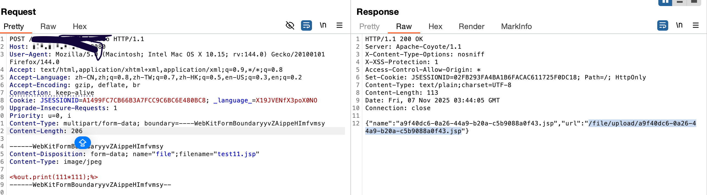

# 保伦电子itC-uploadFileApp任意文件上传

fofa:

app="HC-视频会议"&&country="CN" && region!="HK"


icon_hash="1698211506" && country="CN" && region!="HK"





```java
@RequestMapping(value={"uploadFileApp"})
public void uploadFileApp(@RequestParam CommonsMultipartFile file, HttpServletRequest request, HttpServletResponse response) {
    File parent = new File("/usr/web/resources/upload/");
    if (!parent.exists()) {
        parent.mkdirs();
    }
    String name = file.getOriginalFilename();
    String alias = UUID.randomUUID().toString();
    if (name.indexOf(".") > -1) {
        alias = String.valueOf(alias) + name.substring(name.lastIndexOf("."), name.length());
    }
    File f = new File("/usr/web/resources/upload/" + alias);
    try {
        FileUtils.copyInputStreamToFile((InputStream)file.getInputStream(), (File)f);
    }
    catch (Exception exception) {
        // empty catch block
    }
    JSONObject jo = new JSONObject();
    jo.put((Object)"name", (Object)alias);
    jo.put((Object)"url", (Object)("/file/upload/" + alias));
    CMSTools.writeToResponse(response, jo.toString());
}
```

# 