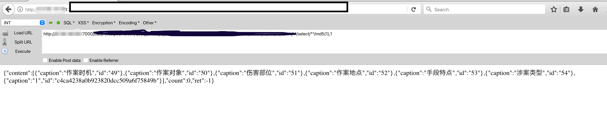

# 天地伟业Easy7-queryDataByTypeEx SQL注入漏洞

漏洞测试

```

```



一直跟进去函数

```java
@RequestMapping({"/queryDataByTypeEx"})
public void queryDataByTypeEx(HttpServletRequest req, HttpServletResponse resp, CLS_VO_WorkBookPageEx voPage) throws IOException {
    resp.getWriter().print(JSONObject.fromObject(this.boWorkBook.queryDataByTypeEx(voPage)));
}
```


```java
public CLS_VO_Result queryDataByTypeEx(CLS_VO_WorkBookPageEx voPage) throws UnsupportedEncodingException {
    return this.daoWorkBook.queryDataByTypeEx(voPage.getTabname());
}
```


发现直接sql注入拼接进去，没有过滤，没有使用结构话查询。

拼接以后的sq l语句：

SELECT S_ID , S_CAPTION FROM  TAB_WORKBOOK_TYPE where 1=1  union  select md5(1),1

```java
public CLS_VO_Result queryDataByTypeEx(String tabName) {
    CLS_VO_Result result = new CLS_VO_Result();
    if (tabName != null && !tabName.equals("")) {
        ArrayList<CLS_VO_DataDirectory> ddList = new ArrayList();
        String sql = "SELECT S_ID , S_CAPTION FROM  " + tabName;
        Session session = this.getHibernateTemplate().getSessionFactory().getCurrentSession();
        SQLQuery query = session.createSQLQuery(sql);

        for(Object[] obj : query.list()) {
            String id = null;
            String caption = null;
            if (obj[0] != null && !"".equals(obj[0])) {
                id = (String)obj[0];
            }

            if (obj[1] != null && !"".equals(obj[1])) {
                caption = (String)obj[1];
            }

            CLS_VO_DataDirectory dd = new CLS_VO_DataDirectory(id, caption);
            ddList.add(dd);
        }

        result.setContent(ddList);
        return result;
    } else {
        result.setRet(-7);
        log.error("id == null ||id.equals('')");
        return result;
    }
}
```


# 